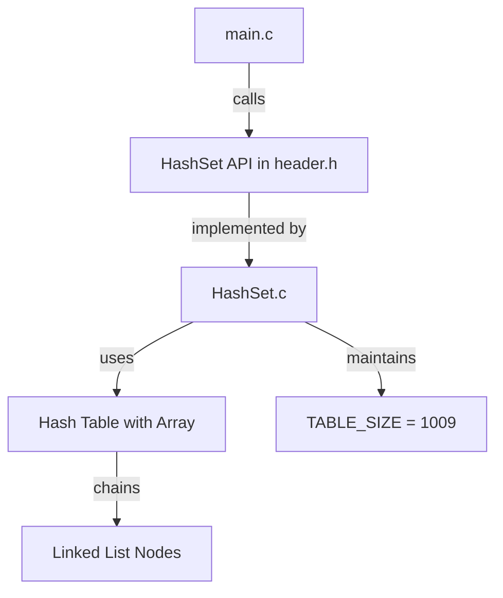

# HashSet Implementation

This repository contains a simple C implementation of a HashSet using a hash table with chaining for collision resolution.

## Files

- `header.h` - HashSet struct definition and function declarations.
- `HashSet.c` - HashSet operations including create, add, remove, contains, display, and delete.
- `main.c` - Example program that demonstrates creating a HashSet, adding and removing elements, and displaying the set.

## Features

- Hash table with modulo hash function
- `addHashSet` for inserting elements
- `removeHashSet` for deleting elements
- `hashSetContains` for checking if element exists
- `displayHashSet` for printing current set contents
- Collision resolution using chaining with linked lists
- Dynamic memory management

## Build

Use a C compiler such as `gcc`:

```bash
gcc main.c HashSet.c -o hashset
```

## Structure Diagram

The following block diagram shows the high-level structure and relationships of the implementation:



## Run

```bash
./hashset
```

## Notes

- The HashSet implementation uses a hash table with an array of size 1009 (prime number).
- Collisions are handled using separate chaining with linked lists.
- The hash function uses modulo operation for distributing keys across the table.
- Each node stores a key and a pointer to the next node in the chain.
